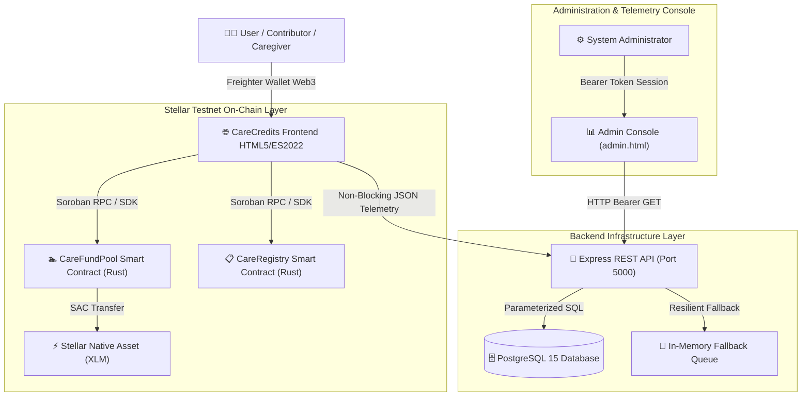
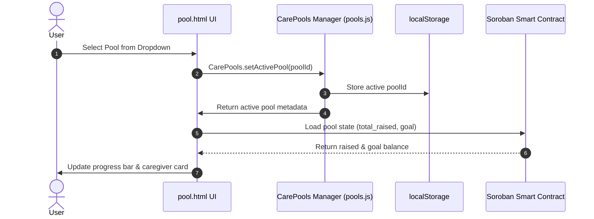
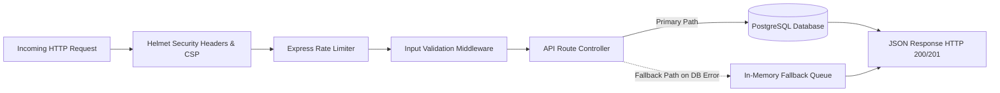
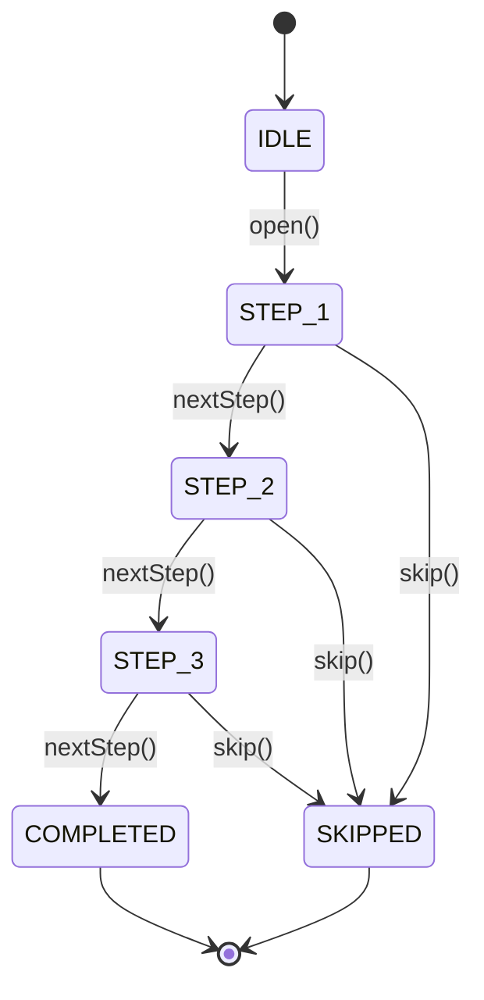
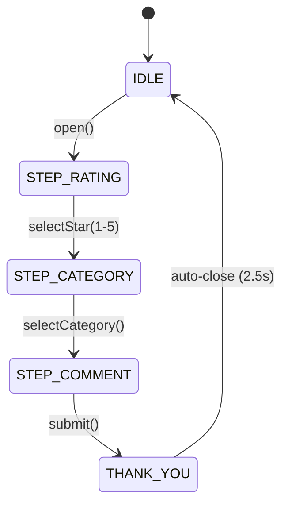

# 🏛️ CareCredits System Architecture

**CareCredits Level 4 (Green Belt) — Technical Architecture Specification**  
**Version:** 1.0.0 (Production Hardened)

---

## 📑 System Overview

CareCredits is a decentralized, healthcare micro-funding platform deployed on the **Stellar Testnet** using **Soroban Smart Contracts** (`CareRegistry` & `CareFundPool`) paired with a high-performance **Express / PostgreSQL** analytics and feedback infrastructure.

---

## 🏊 On-Chain Soroban Smart Contracts (Rust)

CareCredits utilizes two compiled WebAssembly (`wasm32-unknown-unknown`) smart contracts built with `soroban-sdk v22.0.1`:

### 1. `CareRegistry` Contract (`contracts/registry`)
- **Address:** `CDYIHXTJFHHL4RFDEDIJ4CA2LTTYDQXAPIKJ4KRRQYJYFGCPJZHE4224`
- **Purpose:** On-chain registry of authorized, background-verified healthcare caregivers.
- **Admin Security:** Requires `admin.require_auth()` on `initialize()` and `register_caregiver()` to prevent unauthorized authority hijacking.
- **Functions:**
  - `initialize(admin: Address)`
  - `register_caregiver(admin: Address, caregiver: Address, metadata_uri: String)`
  - `verify_caregiver(admin: Address, caregiver: Address)`
  - `pause_caregiver(admin: Address, caregiver: Address)`
  - `is_verified(caregiver: Address) -> bool`

### 2. `CareFundPool` Contract (`contracts/fund_pool`)
- **Address (Primary):** `CDSBFPVCUE6V7HAEMUYY5RSOXV34TIC5EKJZMBEG3J3XKXIERA2EV6CN`
- **Purpose:** Escrow and distribution pool for caregiver health-support goals.
- **Functions:**
  - `initialize(admin: Address, registry: Address, caregiver: Address, goal_amount: i128)`
  - `deposit(contributor: Address, amount: i128)`
  - `withdraw(caregiver: Address, amount: i128)`
  - `get_pool_status() -> PoolStatus`

---

## 🏊 Multi-Pool Architecture (`pools.js`)

CareCredits supports multi-pool funding instances on Stellar Testnet through a dynamic client-side registry (`pools.js`):

---

## 🚀 Backend Infrastructure & Telemetry Layer

The backend service is powered by Express, Helmet security headers, Winston structured logs, PostgreSQL, and resilient fallback queues.

---

## 🔄 Finite State Machines (FSM)

### 1. Interactive Onboarding FSM (`onboarding.js`)

### 2. User Experience Center Feedback FSM (`feedback.js`)

