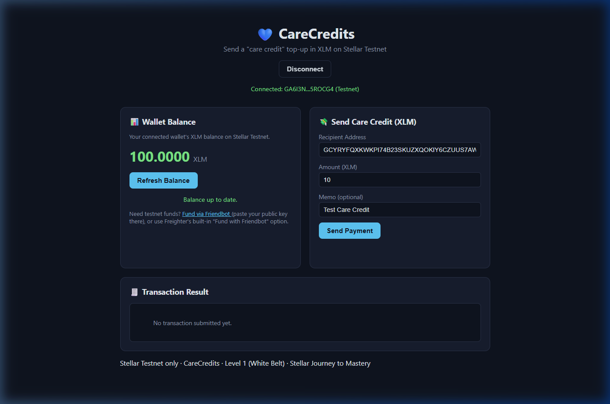
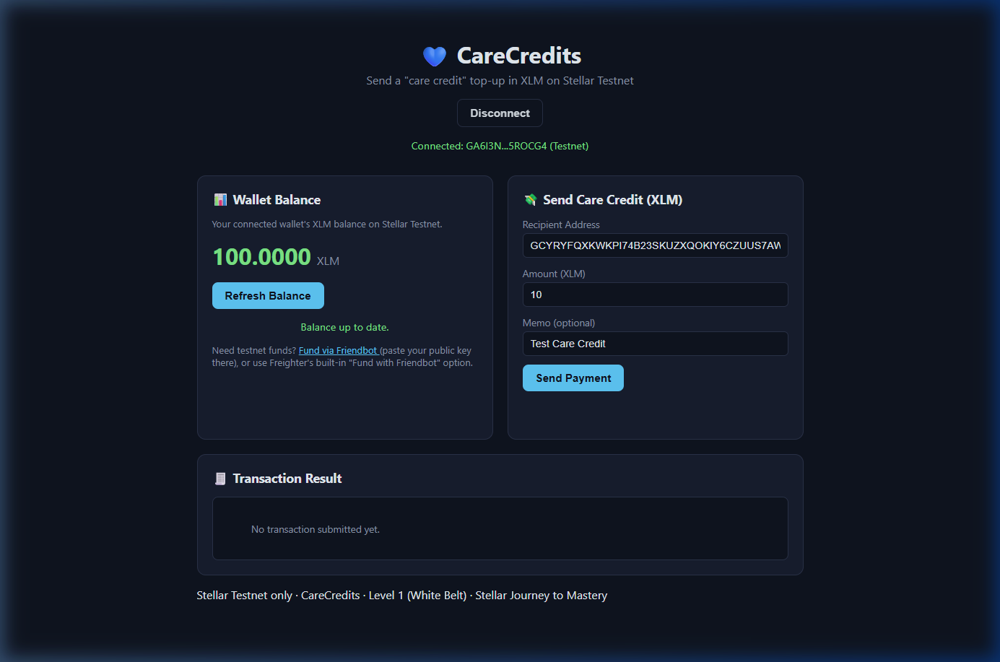
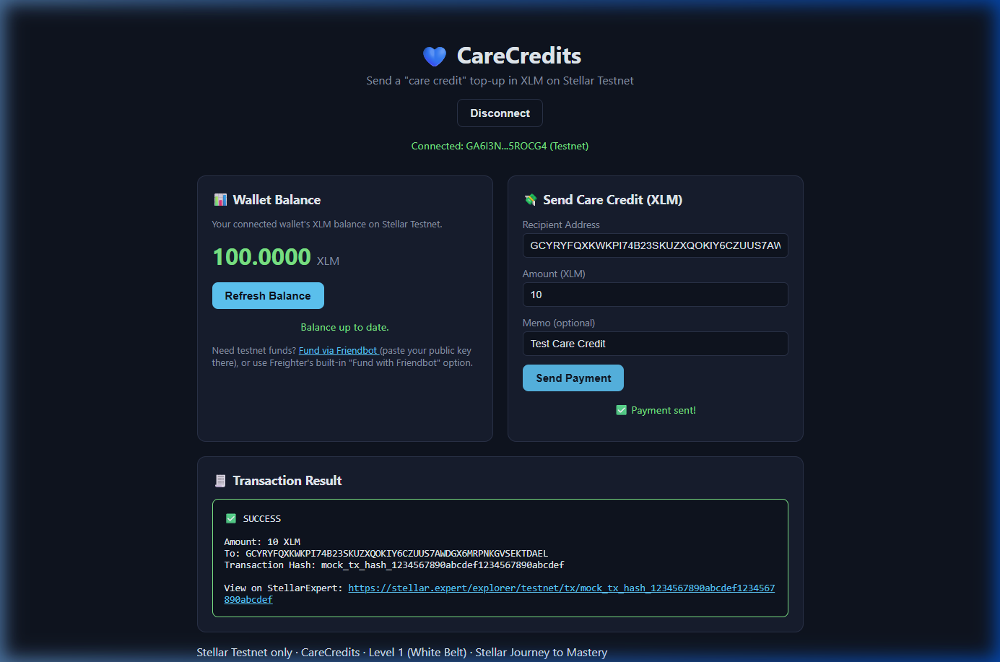
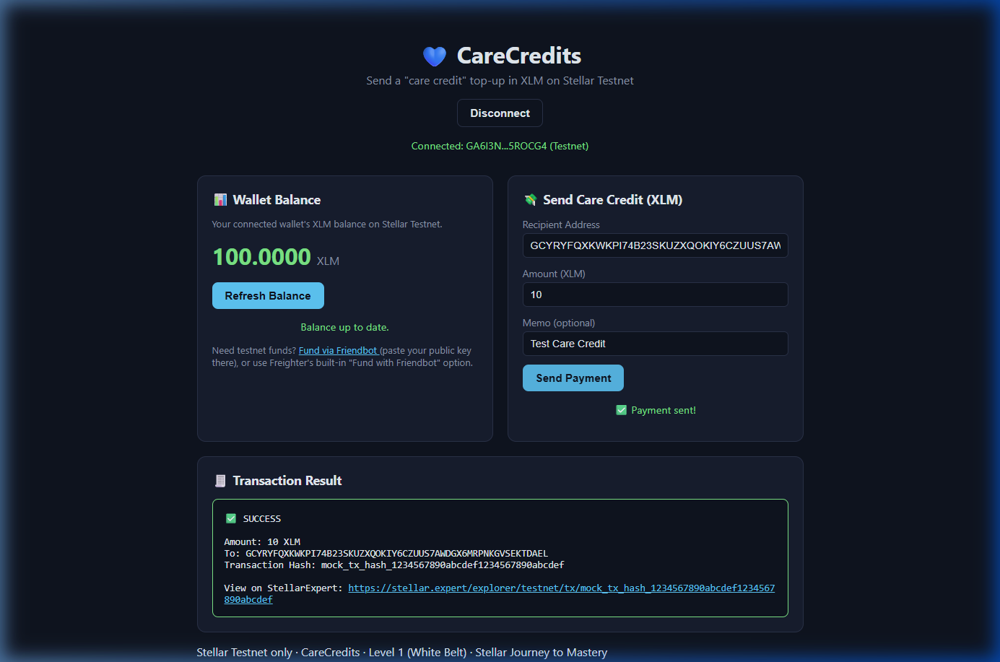

# CareCredits — Simple Payment dApp
### Stellar Journey to Mastery — Level 1 (White Belt) Submission

## 📖 Project Description
CareCredits is a startup concept for cross-border elder care: diaspora workers top up ring-fenced "care credit" balances for caregivers looking after family back home, instead of sending raw cash.

This White Belt submission is the foundational piece of that idea: a **Simple Payment dApp** that connects to the Freighter wallet, displays the connected wallet's live XLM balance, and lets the user send a real XLM payment (a "care credit top-up") to any address on the Stellar Testnet — with clear success/failure feedback and the transaction hash shown to the user.

It is a plain static site (HTML/CSS/JavaScript, no build step, no framework) so it's easy to review, run, and deploy.

## ✅ Level 1 Requirements Covered
- **Wallet Setup** — uses the Freighter browser wallet; hard-coded to Stellar **Testnet** (the app checks Freighter's active network and warns if it isn't set to Testnet).
- **Wallet Connection** — "Connect Freighter Wallet" requests access and displays the connected address; "Disconnect" clears the app's session state.
- **Balance Handling** — fetches the connected account's XLM balance from Horizon and displays it clearly, with a "Refresh Balance" button and a Friendbot funding link for empty accounts.
- **Transaction Flow** — builds a real Payment operation, has Freighter sign it, submits it to Testnet, and shows the user a clear success/failure panel including the transaction hash and a StellarExpert link.
- **Development Standards** — separated concerns (`index.html` for structure, `style.css` for UI, `app.js` for wallet integration/balance fetch/transaction logic), with try/catch error handling around every network call.

## 🖼 Screenshots
> Add your own screenshots here before submitting — the checklist requires all four:

| State | Screenshot |
|---|---|
| **Wallet connected** |  |
| **Balance displayed** |  |
| **Successful testnet transaction** |  |
| **Transaction result shown to user** |  |

## 🛠 Setup Instructions (Run Locally)

### Prerequisites
- [Freighter wallet](https://www.freighter.app/) browser extension installed
- Freighter set to **Testnet** (Settings → Network → Testnet inside the extension)
- A modern browser (Chrome, Brave, Firefox with Freighter installed)
- Any static file server — no `npm install` or build step needed

### Steps
```bash
# 1. Clone this repo
git clone <your-repo-url>
cd carecredits-white-belt

# 2. Serve it as a static site (pick one)
npx serve .
# or
python3 -m http.server 8080

# 3. Open the printed local URL in your browser (e.g. http://localhost:8080)
```

### Using the App
1. Click **Connect Freighter Wallet** and approve the connection in the Freighter popup.
2. If your account has no Testnet XLM yet, use the **Fund via Friendbot** link (or Freighter's own "Fund with Friendbot" button) to get free test funds.
3. Your **balance** displays automatically after connecting; use **Refresh Balance** any time.
4. Fill in a recipient address (any valid Testnet `G...` public key — you can generate one in a second Freighter account, or ask a friend), an amount, and an optional memo, then click **Send Payment**.
5. Approve the signature request in Freighter. The **Transaction Result** panel will show success (with the transaction hash and a StellarExpert link) or a clear failure reason.
6. Click **Disconnect** to clear the session.

## 📁 Project Structure
```
carecredits-white-belt/
├── index.html      # UI structure: wallet bar, balance card, send form, result panel
├── style.css        # Styling
├── app.js           # Freighter integration, balance fetching, transaction building/signing/submission
├── screenshots/      # Add your submission screenshots here
└── README.md
```

## ⚠️ Notes
- This app runs on **Stellar Testnet only** — no real funds are ever involved.
- `app.js` loads `@stellar/stellar-sdk` and `@stellar/freighter-api` from the `esm.sh` CDN so the project needs zero install step. For a production build you'd install both as npm dependencies and bundle them instead.
- Freighter does not expose a way for a website to programmatically revoke its own access — "Disconnect" here clears this app's local session; full site-access revocation happens from within the Freighter extension itself (Settings → Manage Connected Apps).

## 🔜 Next Steps (Level 2 Preview)
Level 2 (Yellow Belt) will extend this into multi-wallet integrations (a family-oversight co-signer), a Soroban smart contract for ring-fenced care-credit balances, richer transaction handling, and real-time event synchronization via Horizon streaming.
