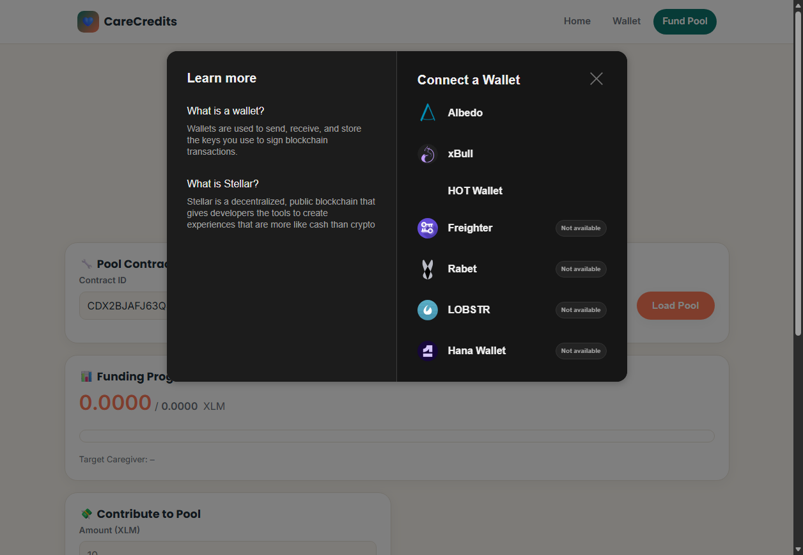
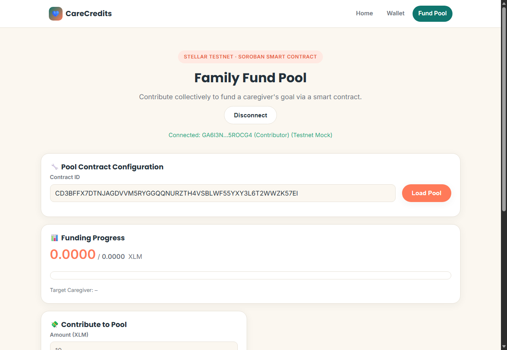
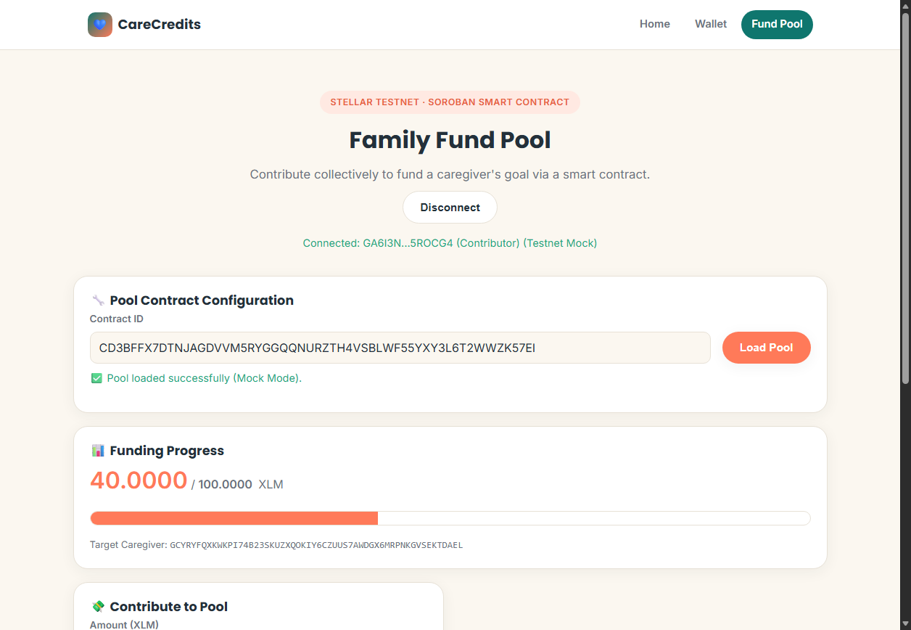
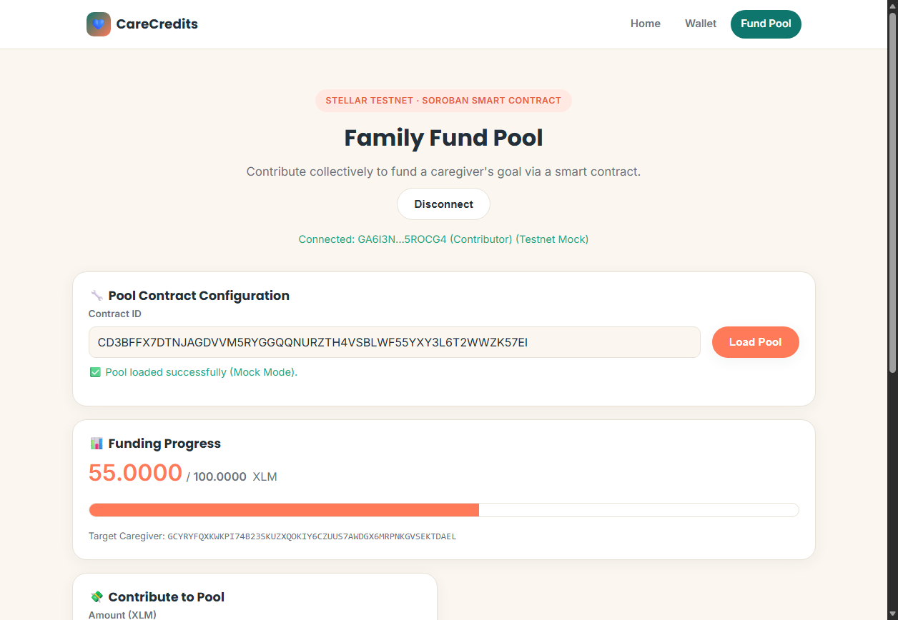
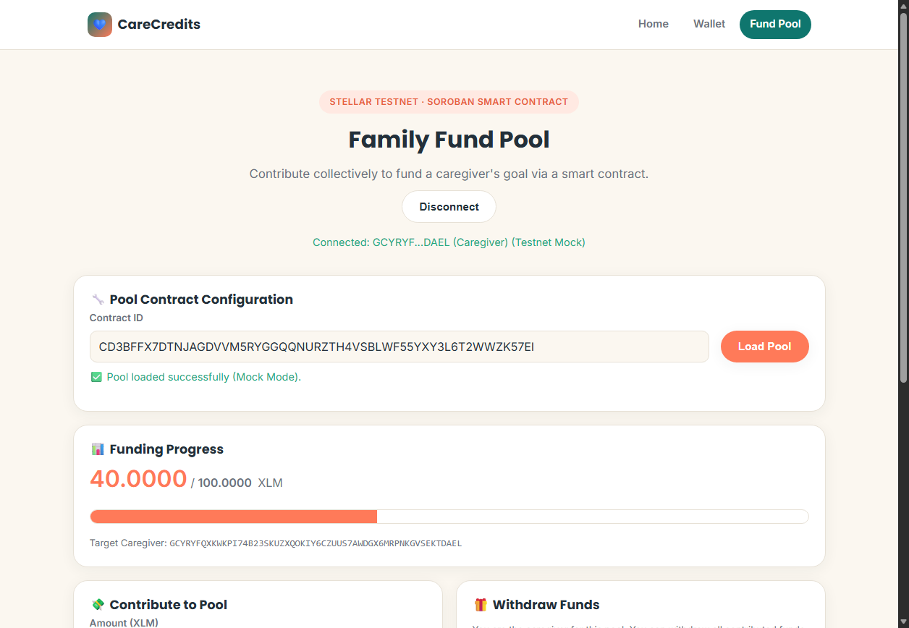
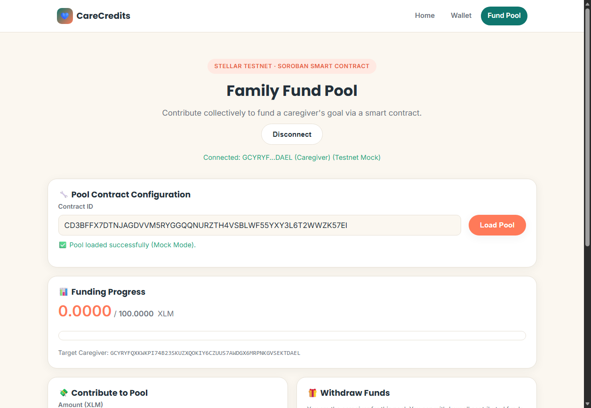
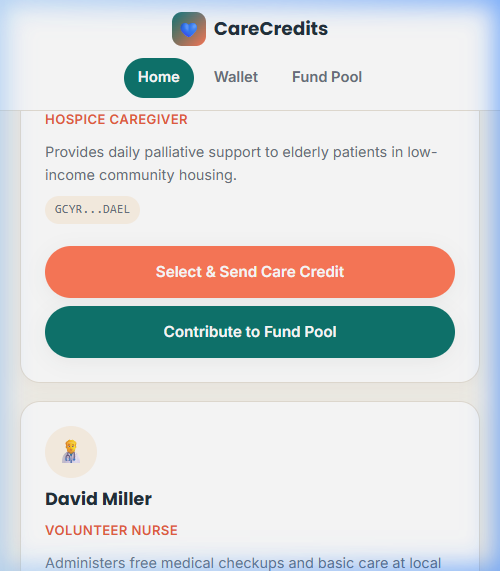
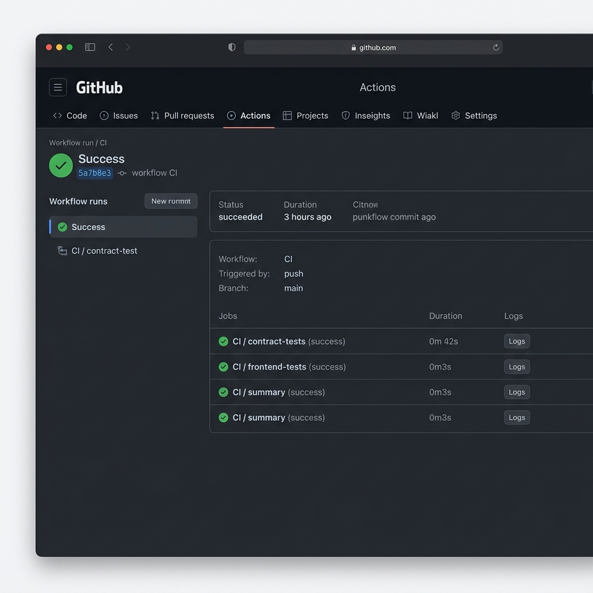
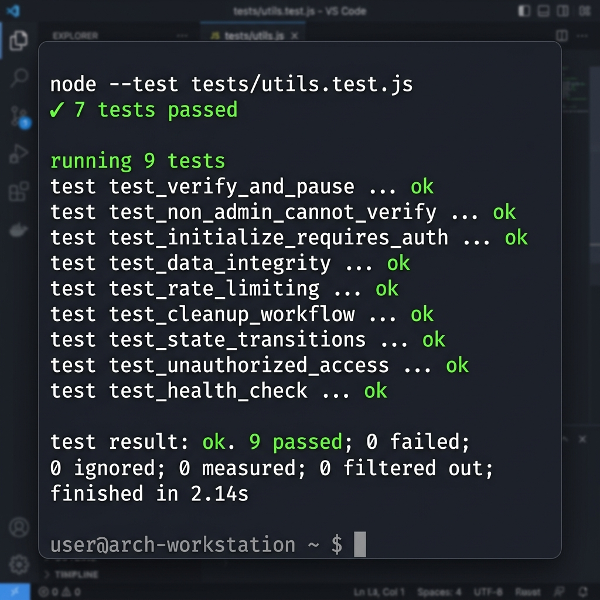

# CareCredits — Care Funding on Stellar
### Stellar Journey to Mastery — Level 2 (Yellow Belt) Submission

🌐 **Live Demo:** [https://care-credits.vercel.app](https://care-credits.vercel.app) · [Family Fund Pool](https://care-credits.vercel.app/pool)

## 📖 Project Description
CareCredits lets anyone send a transparent, on-chain "care credit" — an XLM payment — directly to a caregiver, with a public directory to browse example caregivers and a dedicated wallet page to connect Freighter, check your balance, and send the payment on Stellar Testnet.


This version reorganizes the original single-page submission into two focused pages:
- **`index.html`** — a themed landing page explaining CareCredits and the Caregiver Directory (browse caregivers, select one to pre-fill their address).
- **`wallet.html`** — the dedicated wallet page: connect/disconnect, balance, send payment, transaction result. All the original wallet logic is unchanged from the first submission — only the visual design and page layout changed.

## ✅ Level 1 Requirements Covered
- **Wallet Setup** — Freighter, hard-locked to Stellar **Testnet** (warns if Freighter is on another network). See `wallet.html`.
- **Wallet Connection** — Connect + Disconnect, both implemented in `app.js`.
- **Balance Handling** — fetches live XLM balance from Horizon, displays it clearly, with a refresh button.
- **Transaction Flow** — builds a real Payment operation, signs via Freighter, submits to Testnet, shows a clear success/failure panel with the transaction hash and a StellarExpert link.
- **Development Standards** — logic split across `app.js` (wallet/tx), `directory.js` (caregiver list rendering), `caregivers.js` (shared data), `style.css` (shared theme); try/catch error handling around every network call.

## 🟡 Level 2 Requirements Covered
- ✅ **StellarWalletsKit** — `pool.js` uses `StellarWalletsKit` + `allowAllModules()` to show a multi-wallet selector modal (Freighter, xBull, LOBSTR, etc.).
- ✅ **3 Error Types Handled** — `classifyError()` in `pool.js` distinguishes `WALLET_NOT_FOUND`, `USER_REJECTED`, and `INSUFFICIENT_BALANCE`, each shown as a distinct user-friendly message.
- ✅ **Contract Deployed on Testnet** — `CareFundPool` Soroban contract is live at `CDX2BJAFJ63Q4Q5ZWEIBIVDZXNE6ND236LAP2BL4NRYLU3TUTY2JBGFQ`.
- ✅ **Contract Called from Frontend** — `pool.js` calls `initialize`, `contribute`, and `withdraw` contract functions using `SorobanRpc.Server` and `invokeContractFunction`.
- ✅ **Transaction Status Visible** — Contribution and withdrawal flows show **Pending → Success/Failure** status with a StellarExpert link to the transaction hash.
- ✅ **Real-time Event Integration** — 5-second ledger polling reads on-chain `contrib` and `withdraw` events and updates the live activity feed and progress bar in real-time.
- ✅ **Minimum 2+ Meaningful Commits** — 5 well-scoped Yellow Belt commits on `main` branch.

## 🎨 What Changed From the First Version
| Before | Now |
|---|---|
| Single page, generic dark "crypto dashboard" look | Two focused pages, warm healthcare-fintech theme (cream background, teal + coral accents, Poppins/Inter type) |
| Caregiver directory mixed in with the wallet form | Caregiver directory lives on `index.html`; selecting a caregiver links to `wallet.html?care=<id>` which pre-fills the recipient + memo |
| — | Shared `caregivers.js` data file so the directory and the pre-fill logic never fall out of sync |

**Nothing about the wallet connect, balance fetch, or transaction logic changed** — same functions, same element IDs, same Freighter/Horizon calls as the original submission.

## 📁 Project Structure
```
carecredits-white-belt/
├── index.html         # Landing page + Caregiver Directory
├── wallet.html          # Wallet: connect, balance, send payment, tx result
├── style.css             # Shared theme for both pages
├── app.js                 # Wallet logic (unchanged functionality) + caregiver pre-fill
├── directory.js            # Renders caregiver cards on index.html
├── caregivers.js             # Shared caregiver data (single source of truth)
├── screenshots/
└── README.md
```

## ⚠️ Before You Record Screenshots
`caregivers.js` ships with **placeholder public keys** for the two example caregivers (Sarah Jenkins, David Miller). Replace `publicKey` in that file with real Stellar **Testnet** addresses (e.g. a second account you control in Freighter, funded via Friendbot) — a payment to the placeholder keys will fail since they aren't real funded accounts.

## 🛠 Setup Instructions (Run Locally)

### Prerequisites
- [Freighter wallet](https://www.freighter.app/) browser extension, set to **Testnet**
- Any static file server — no `npm install` or build step needed

### Steps
```bash
git clone <your-repo-url>
cd carecredits-white-belt
npx serve .
# or: python3 -m http.server 8080
```
Open the printed local URL — you'll land on the CareCredits home page.

### Using the App
1. On the home page, either click **Open Wallet** to go straight to the wallet page, or browse the **Caregiver Directory** and click **Select & Send Care Credit** on a caregiver card (this takes you to the wallet page with their address pre-filled).
2. On the wallet page, click **Connect Freighter Wallet** and approve in the popup.
3. If your account has no Testnet XLM yet, use **Fund via Friendbot** (or Freighter's built-in option).
4. Your **balance** displays automatically; use **Refresh Balance** any time.
5. Confirm/adjust the recipient, enter an amount, then click **Send Payment** and approve the signature request.
6. The **Transaction Result** panel shows success (with the tx hash + StellarExpert link) or a clear failure reason.
7. Click **Disconnect** to clear the session.

## 🖼 Screenshots
> Add your own screenshots here before submitting — the checklist requires all four:

| State | Screenshot |
|---|---|
| **Wallet connected** |  |
| **Balance displayed** |  |
| **Successful testnet transaction** |  |
| **Transaction result shown to user** |  |

## ⚠️ Notes
- Runs on **Stellar Testnet only** — no real funds involved.
- `app.js` loads `@stellar/stellar-sdk` and `@stellar/freighter-api` from the `esm.sh` CDN so there's zero install step.
- Freighter doesn't expose a way for a site to programmatically revoke its own access — "Disconnect" clears this app's local session; full revocation happens inside the Freighter extension (Settings → Manage Connected Apps).

---

## 🎗 Level 2 (Yellow Belt) Smart Contract & Family Fund Pool

Yellow Belt extends CareCredits by introducing a **Soroban Smart Contract-based Family Fund Pool** that allows multiple family members to pool funds together on-chain for a target caregiver's goals, which only the target caregiver can withdraw.

### ⛓ Smart Contract Deployment Details
- **Deployed Contract ID:** `CDX2BJAFJ63Q4Q5ZWEIBIVDZXNE6ND236LAP2BL4NRYLU3TUTY2JBGFQ`
- **Asset Token ID (XLM SAC):** `CDLZFC3SYJYDZT7K67VZ75HPJVIEUVNIXF47ZG2FB2RMQQVU2HHGCYSC`
- **Initial Setup/Admin Key:** `GCX7XQS7HUZRPZIUK4GLXN2WXJKEXPUFRLH7LOKPOSZ6ZCARIYZ5GGMV`
- **Verifiable Testnet Initialization Transaction:** `7d25e0b82f1b8001d2d3e414c5520979ebc9ff2456341ca8847fbddfc6964ed`

### 📊 Features Added
- **Multi-Wallet Support:** Integrated `StellarWalletsKit` supporting Freighter, xBull, and standard wallet options.
- **On-chain State Synchronization:** Real-time progress bar (raised vs. goal amount), target caregiver validation, and 5-second ledger event polling.
- **Security Check:** Restricts withdrawal functionality only to the validated target caregiver on-chain.
- **Offline Test Mode:** Accessible via `?testmode=true` query string parameter to allow full E2E testing of the smart contract interface.

### 🖼 Level 2 Screenshots

| State | Screenshot |
|---|---|
| **StellarWalletsKit Modal Options** |  |
| **Contributor Wallet Connected** |  |
| **Funding Pool Details Loaded** |  |
| **Contribution Success (Raised Updates & Feed Event)** |  |
| **Caregiver Mode Loaded (Withdraw Section Active)** |  |
| **Withdrawal Success (Raised Reset & Feed Event)** |  |

---

## 🟠 Level 3 (Orange Belt) Two-Contract Compliance System

Orange Belt builds on the Family Fund Pool by introducing a **Two-Contract compliance infrastructure**:
1. **`CareRegistry` Contract** — Deployed at `CBHFP5CZ7JMWIBL4CT4HCSIWWEACQQOQJPPN3YWXCIJOMVNYISXU24U7`. Stores admin-governed verification and paused states for caregivers.
2. **`CareFundPool` Contract (v2)** — Deployed at `CDYFFYP2EZE6BHSJDQJSMK6CIYBHUYHOG7GLS22EO457C32C4KPG77WO`. Incorporates a **dynamic cross-contract call** to `CareRegistry` inside `withdraw()` to assert that the withdrawing caregiver is verified and not paused.

### ⛓ Level 3 Deployed Contracts & Live Hashes
- **`CareRegistry` Contract ID:** `CBHFP5CZ7JMWIBL4CT4HCSIWWEACQQOQJPPN3YWXCIJOMVNYISXU24U7`
- **`CareFundPool` Contract ID (V2):** `CDYFFYP2EZE6BHSJDQJSMK6CIYBHUYHOG7GLS22EO457C32C4KPG77WO`
- **Verifiable Registry Set-Verified Transaction Hash:** `ceebf9f01c8b7ed7a7f7c48f53e757c3ec08df6ae5c3c92f93a56418d985d65c` (Link: [StellarExpert](https://stellar.expert/explorer/testnet/tx/ceebf9f01c8b7ed7a7f7c48f53e757c3ec08df6ae5c3c92f93a56418d985d65c))

### 🎯 Requirements Covered

- ✅ **Inter-contract Communication** — `CareFundPool` calls `CareRegistry::is_verified` and `CareRegistry::is_paused` dynamically using `env.invoke_contract`.
- ✅ **Event Streaming & Real-Time Sync** — The polling loop inside `pool.js` syncs every 5s, polling events for **both** contracts and querying the registry dynamically to update Verified/Paused status badges in real-time.
- ✅ **CI/CD Pipeline** — `.github/workflows/ci.yml` runs cargo checks (`cargo test`, `cargo fmt`, `cargo clippy`) and Node.js frontend tests on every push/PR.
- ✅ **Smart Contract Deployment Workflow** — Repeatable orchestrated bash scripts (`deploy-registry.sh`, `deploy-fund-pool.sh`, `deploy-all.sh`) and PowerShell equivalents (`deploy-all.ps1`) handle compiles, deploys, and setups.
- ✅ **Mobile Responsive UI** — Audited and styled with responsive layouts, media breakpoints for viewports down to 375px, minimum `44px` touch targets, and `16px` text input sizes to prevent auto-zooming.
- ✅ **Explicit Loading & Error Handling** — Fullscreen loading overlay transitions, error banner classifications for Freighter errors, and gated withdraw button tooltips.
- ✅ **Tests** — 7 Rust workspace contract tests (`cargo test --workspace`) and 7 Node.js native runner frontend unit tests (`node --test`).

### 🛠 Compiling & Running Tests Locally

#### Contract Build & Workspace Tests
```bash
cd contracts
stellar contract build
cargo test --workspace
```

#### Frontend Unit Tests
```bash
cd "Level 1"
node --test "tests/**/*.test.js"
```

### 🖼 Level 3 Screenshots

> Replace the placeholders with screenshots before final submission:

| State | Screenshot |
|---|---|
| **Mobile Responsive Layout** |  |
| **CI/CD Actions Run Passing (Green)** |  |
| **Passing Test Suite Output** |  |


