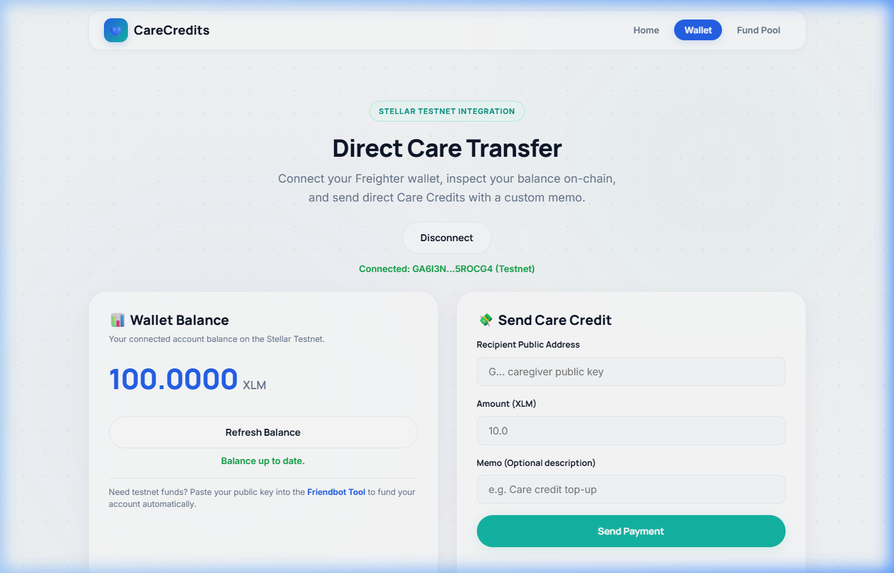
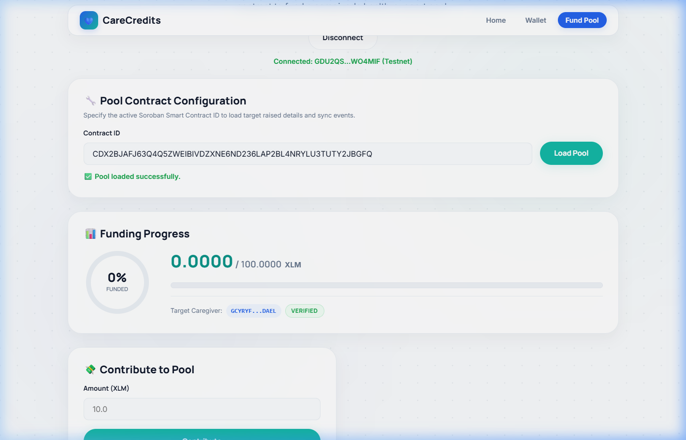
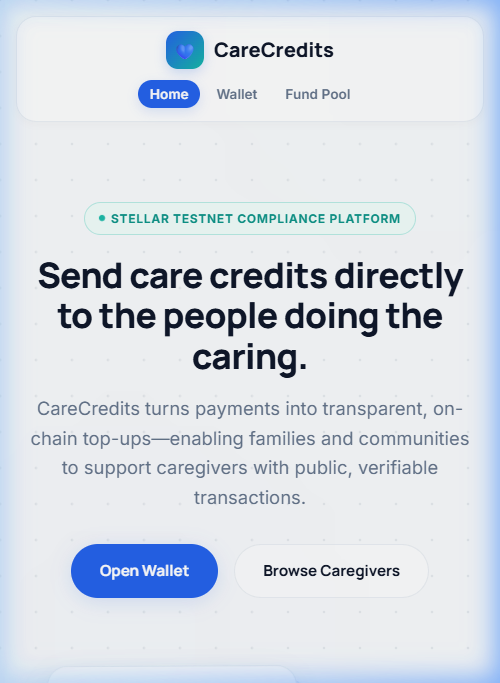

# CareCredits — On-Chain Caregiver Funding & Compliance on Stellar

[](https://github.com/rohitsingh-01/CareCredits/actions/workflows/ci.yml)
[](https://care-credits.vercel.app)
[](LICENSE)
[-orange)](#-submission-portals-journey-to-mastery)

CareCredits is an open-source, healthcare-focused Web3 platform where families can collectively fund caregiver expenses and send direct care credit payments through the Stellar network with on-chain compliance controls.

---

## 🌐 Live Resources & Portals

*   **Live Application:** [https://care-credits.vercel.app](https://care-credits.vercel.app)
*   **Demo Video Walkthrough:** [CareCredits Walkthrough (YouTube)](https://youtu.be/UgHnk698BJw?si=XiN6-4QFzVk9UR-i)
*   **GitHub Repository:** [https://github.com/rohitsingh-01/CareCredits](https://github.com/rohitsingh-01/CareCredits)

---

## 🥋 Submission Portals (Journey to Mastery)

For detailed evidence, step-by-step requirements, screenshots, and security analyses, use the following navigation index:

| Documentation | Description |
|---|---|
| **[README_WHITE_BELT.md](docs/README_WHITE_BELT.md)** | White Belt implementation |
| **[README_YELLOW_BELT.md](docs/README_YELLOW_BELT.md)** | Yellow Belt implementation |
| **[README_ORANGE_BELT.md](docs/README_ORANGE_BELT.md)** | Orange Belt implementation |
| **[ARCHITECTURE.md](docs/ARCHITECTURE.md)** | System architecture |
| **[DEPLOYMENT.md](docs/DEPLOYMENT.md)** | Deployment guide |
| **[SECURITY.md](docs/SECURITY.md)** | Security model |
| **[CONTRIBUTING.md](CONTRIBUTING.md)** | Contribution guide |
| **[LICENSE](LICENSE)** | Open-source MIT License |

---

## 💡 System Architecture Summary

The CareCredits system consists of a static web frontend integrated with two smart contracts on the Stellar Testnet:
1.  **`CareRegistry` Contract:** Stores administrator-managed verification and pause states for caregivers.
2.  **`CareFundPool` Contract:** Processes contributions and gates withdrawals by dynamically querying `CareRegistry` credentials on-chain during the withdrawal sequence.

For a complete data flow layout, see the [Architecture Document](docs/ARCHITECTURE.md).

---

## 🛠️ Technology Stack

*   **Smart Contracts:** Rust, [Soroban Smart Contract SDK](https://soroban.stellar.org/) (Protocol 21/27 compatible).
*   **Web Frontend:** HTML5, Vanilla JavaScript, CSS3 (Glassmorphism, custom breakpoints).
*   **Wallet Integration:** `@stellar/freighter-api`, `@creit.tech/stellar-wallets-kit` (Freighter, xBull, Albedo).
*   **Ledger Services:** Stellar Horizon API, Soroban RPC Server.
*   **CI/CD:** GitHub Actions (Cargo fmt, Clippy lints, Rust workspace tests, Node.js unit tests).

---

## 🚀 Quick Start (Run Locally)

1.  **Clone the Repository:**
    ```bash
    git clone https://github.com/rohitsingh-01/CareCredits.git
    cd CareCredits
    ```
2.  **Launch a Dev Server:**
    ```bash
    npx serve .
    ```
3.  **Access the App:**
    - Navigate to `http://localhost:3000/index.html` (Caregiver Directory).
    - Navigate to `http://localhost:3000/pool.html` (Fund Pool page).
    - Navigate to `http://localhost:3000/wallet.html` (Direct Transfer page).
    - *Tip:* Append `?testmode=true` to test the wallet interfaces offline.

---

## 🧪 Testing Summary

We run automated tests across both backend and frontend layers:

*   **Rust Contract Workspace Tests:** 9 test cases asserting administrative controls, contributions, and negative scenarios (unverified/paused caregivers, unauthorized initialization):
    ```bash
    cargo test --workspace --manifest-path contracts/Cargo.toml
    ```
*   **Frontend Helper Tests:** 6 Node test blocks validating math conversions and error parsers:
    ```bash
    node --test "tests/**/*.test.js"
    ```

---

## 🤖 CI/CD Build Summary

Our GitHub Actions workspace performs the following actions on every push or pull request to the `main` branch:
1.  Verify code formatting (`cargo fmt`).
2.  Run strict quality checks and lints (`cargo clippy -- -D warnings`).
3.  Execute all workspace contract tests (`cargo test`).
4.  Run all frontend Javascript tests (`node --test`).

---

## 📁 Project Repository Structure

```
CareCredits/
├── .github/workflows/          # CI/CD pipelines (ci.yml, deploy.yml)
├── contracts/                  # Rust Smart Contracts Workspace
│   ├── registry/               # CareRegistry crate
│   └── fund_pool/              # CareFundPool crate
├── docs/                       # Comprehensive documentation index
│   ├── ARCHITECTURE.md         # Architecture data flows & sequence diagrams
│   ├── DEPLOYMENT.md           # Local compiling and Vercel hosting guides
│   ├── README_ORANGE_BELT.md   # Orange Belt requirements evidence
│   ├── README_WHITE_BELT.md    # White Belt requirements evidence
│   ├── README_YELLOW_BELT.md   # Yellow Belt requirements evidence
│   └── SECURITY.md             # Gas, memory, and authorization specifications
├── index.html                  # Caregiver Directory (main page)
├── pool.html                   # Family Fund Pool page
├── wallet.html                 # Direct Transfer page
├── pool.js                     # Pool page logic & wallet kit
├── app.js                      # Direct transfer wallet logic
├── style.css                   # Custom global styles
├── utils.js                    # Math, format, and error helpers
├── caregivers.js               # In-memory caregiver profiles
├── screenshots/                # Verified E2E proof screenshots
├── tests/                      # Frontend unit tests
├── CONTRIBUTING.md             # Development workflow & git conventions
├── LICENSE                     # MIT Open Source License
└── README.md                   # Repository homepage & index
```

---

## ⛓️ Deployed Contract Addresses (Stellar Testnet)

*   **CareRegistry ID (Compliance/Admin Layer):** [`CBHFP5CZ7JMWIBL4CT4HCSIWWEACQQOQJPPN3YWXCIJOMVNYISXU24U7`](https://stellar.expert/explorer/testnet/contract/CBHFP5CZ7JMWIBL4CT4HCSIWWEACQQOQJPPN3YWXCIJOMVNYISXU24U7)
*   **CareFundPool (V2 Funding Layer):** [`CDYFFYP2EZE6BHSJDQJSMK6CIYBHUYHOG7GLS22EO457C32C4KPG77WO`](https://stellar.expert/explorer/testnet/contract/CDYFFYP2EZE6BHSJDQJSMK6CIYBHUYHOG7GLS22EO457C32C4KPG77WO)

---

## 🔒 Verification & Compliance Proofs

We deployed the active instances and ran dynamic operations to demonstrate the on-chain compliance gate in action:

1.  **Registry Verification Call (Pre-verifying caregiver):** [`ceebf9f01c8b7ed7a7f7c48f53e757c3ec08df6ae5c3c92f93a56418d985d65c`](https://stellar.expert/explorer/testnet/tx/ceebf9f01c8b7ed7a7f7c48f53e757c3ec08df6ae5c3c92f93a56418d985d65c)
2.  **Pool Initialization (V2):** [`cdfbc06cc5a27d5e2e844b898248b71ec7144e628deb7d983b4e116fa9d3b168`](https://stellar.expert/explorer/testnet/tx/cdfbc06cc5a27d5e2e844b898248b71ec7144e628deb7d983b4e116fa9d3b168)

---

## 🖼️ Verified E2E Screenshot Previews

All screenshots are stored inside the [`screenshots/`](screenshots) directory:

| State / View | Screenshot |
|---|---|
| **Freighter Connected & Balance Loaded** |  |
| **Family Fund Pool details loaded** |  |
| **Mobile responsive UI layout** |  |

---

## 📄 License & Credits

Distributed under the MIT License. See [LICENSE](LICENSE) for more information.
Built with 💙 for the Stellar Journey to Mastery.
