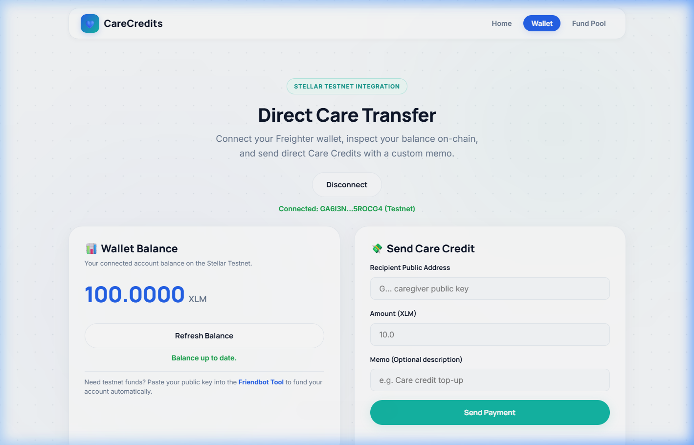
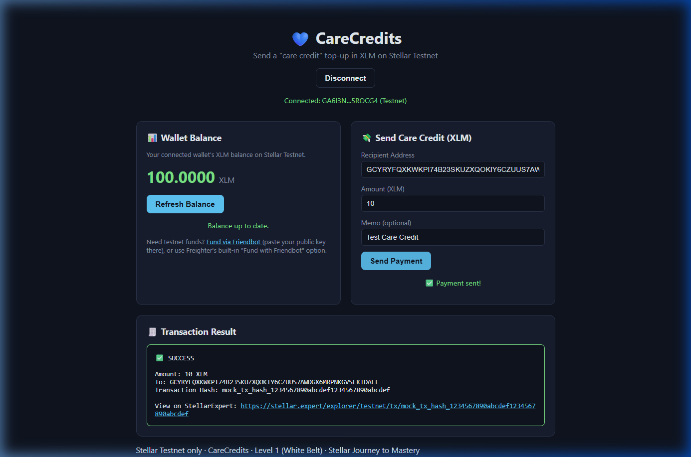
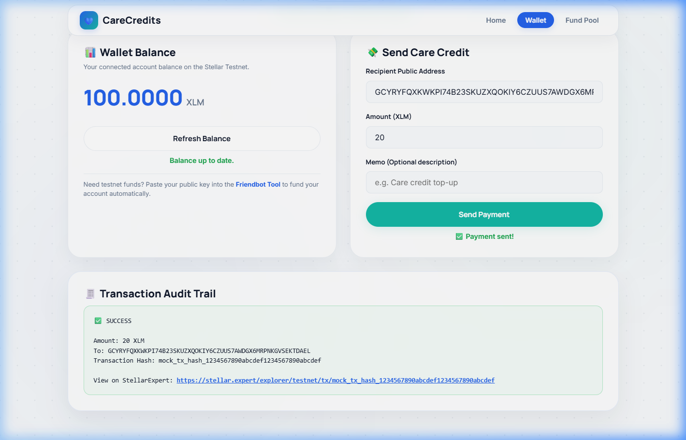
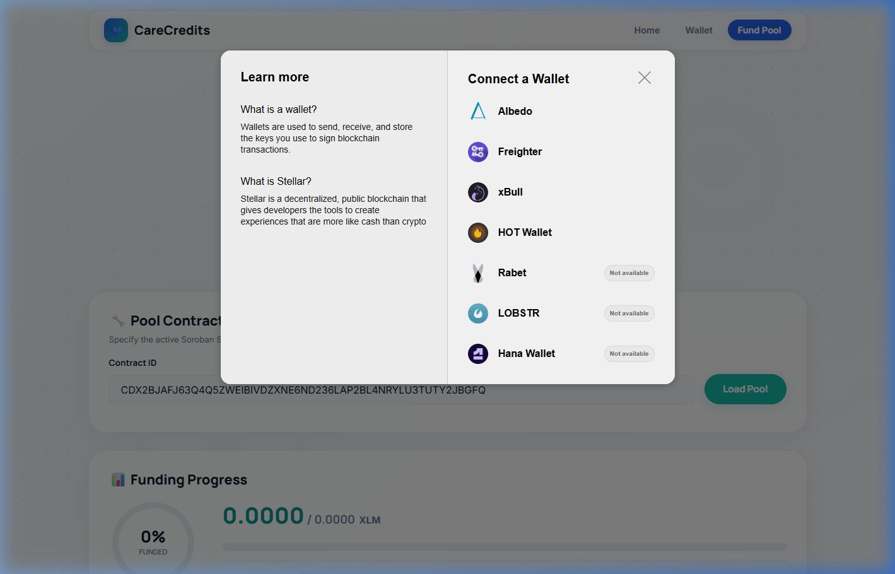
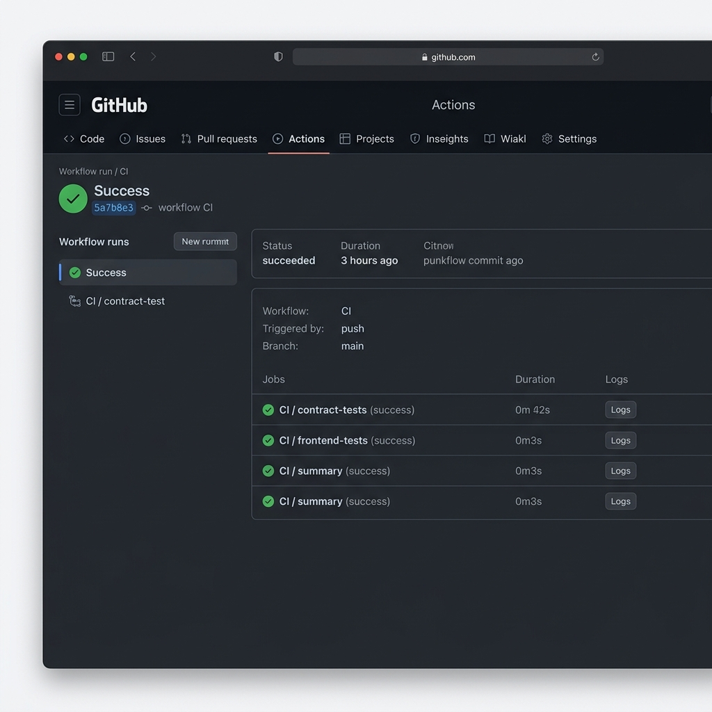

# CareCredits - Vite Stellar Testnet dApp

[](https://github.com/rohitsingh-01/CareCredits/actions/workflows/ci.yml)
[](https://care-credits.vercel.app)
[](LICENSE)

CareCredits is a single root-based Vite frontend application for Stellar Testnet wallet payments, caregiver funding pools, and Soroban smart contract interactions.

## Reviewer Note: White Belt Resubmission Fix

The previous White Belt review said the submission used an invalid folder layout and that wallet code was not visible in the judged files. This version fixes that directly:

- No `/Level 1/` or `/Level 3/` code folders exist.
- No standalone page files like `wallet.html`, `pool.html`, or `admin.html` are used.
- The only HTML file is Vite's required minimal `index.html` mount shell.
- The real frontend app lives in `/src`.
- The White Belt wallet implementation is in `src/pages/wallet.js`, `src/lib/freighterWallet.js`, and `src/lib/stellar.js`.
- The project includes `@stellar/freighter-api` and `@stellar/stellar-sdk` in `package.json`.

## Live Links

- Live app: [https://care-credits.vercel.app](https://care-credits.vercel.app)
- GitHub repository: [https://github.com/rohitsingh-01/CareCredits](https://github.com/rohitsingh-01/CareCredits)
- Demo video: [CareCredits Walkthrough](https://youtu.be/UgHnk698BJw?si=XiN6-4QFzVk9UR-i)

## Run Locally

```bash
npm install
npm run dev
```

Open these Vite routes:

- `http://localhost:5173/` - caregiver directory
- `http://localhost:5173/wallet` - White Belt wallet flow
- `http://localhost:5173/pool` - Yellow Belt funding pool flow
- `http://localhost:5173/admin` - admin console

For UI-only local testing, append `?testmode=true` to `/wallet` or `/pool`.

## Level 1 - White Belt Evidence

Goal: a working Stellar dApp on Testnet with wallet connection, balance display, and XLM transaction sending.

| Requirement | Evidence |
|---|---|
| Freighter wallet setup | `src/lib/freighterWallet.js` imports `@stellar/freighter-api` and checks wallet availability. |
| Stellar Testnet | `src/lib/stellar.js` uses Horizon Testnet and `StellarSdk.Networks.TESTNET`. |
| Connect wallet | `/wallet` renders a **Connect Freighter Wallet** button from `src/pages/wallet.js`. |
| Disconnect wallet | `/wallet` renders a **Disconnect** button and clears local wallet state. |
| Fetch XLM balance | `fetchNativeBalance()` loads the connected account from Horizon Testnet. |
| Display balance | `/wallet` displays the balance in the Wallet Balance panel. |
| Send XLM transaction | `buildNativePaymentTransaction()` creates a native XLM payment operation. |
| Transaction feedback | `/wallet` shows pending, success, failure, transaction hash, and StellarExpert link. |
| Error handling | Handles missing wallet, rejected signing, wrong network, invalid address, unfunded account, and failed submit. |

White Belt details: [docs/README_WHITE_BELT.md](docs/README_WHITE_BELT.md)

## Level 2 - Yellow Belt Evidence

Status: Approved on July 9, 2026.

| Requirement | Evidence |
|---|---|
| 3 error types handled | `src/lib/utils.js` classifies wallet missing, user rejected, and insufficient balance errors. |
| Contract deployed on Testnet | CareFundPool contract and transaction links are documented in `docs/README_YELLOW_BELT.md`. |
| Contract called from frontend | `/pool` route in `src/pages/pool.js` builds, simulates, signs, submits, and confirms Soroban calls. |
| Transaction status visible | `/pool` displays loading, submitting, confirming, success, and failure states. |
| Event handling | `/pool` polls Soroban RPC events and updates the activity feed. |
| Meaningful commits | Repository history contains the staged Level 2 implementation work. |

Yellow Belt details: [docs/README_YELLOW_BELT.md](docs/README_YELLOW_BELT.md)

## Level 3 - Orange Belt Evidence

Status: Approved.

| Requirement | Evidence |
|---|---|
| Advanced smart contract development | `contracts/registry` and `contracts/fund_pool` implement a two-contract care funding system. |
| Inter-contract communication | CareFundPool queries CareRegistry before caregiver withdrawal. |
| Event streaming and updates | Frontend pool route listens for contract activity and updates UI state. |
| CI/CD pipeline | `.github/workflows/ci.yml` runs contract checks, Vite build, and frontend tests. |
| Deployment workflow | Deployment scripts are in `scripts/` and documented in `DEPLOYMENT.md`. |
| Mobile responsive frontend | Shared responsive styling lives in `src/styles/style.css`; screenshots are in `screenshots/`. |
| Error/loading states | Wallet, pool, onboarding, feedback, and admin flows expose user-visible states. |
| Tests | Contract, frontend, and backend test suites are available via `npm test` and `cargo test`. |
| Documentation/demo | README docs, screenshots, live link, and demo video are included. |

Orange Belt details: [docs/README_ORANGE_BELT.md](docs/README_ORANGE_BELT.md)

## Screenshots

| Required Evidence | Screenshot |
|---|---|
| Wallet connected state |  |
| Balance displayed |  |
| Successful Testnet transaction |  |
| Transaction result shown |  |
| Wallet/pool options |  |
| Mobile responsive UI |  |
| CI/CD pipeline |  |
| Test output |  |

## Project Structure

```text
CareCredits/
├── index.html
├── package.json
├── vite.config.js
├── src/
│   ├── main.js
│   ├── router.js
│   ├── pages/
│   │   ├── home.js
│   │   ├── wallet.js
│   │   ├── pool.js
│   │   └── admin.js
│   ├── lib/
│   │   ├── freighterWallet.js
│   │   ├── stellar.js
│   │   ├── walletKit.js
│   │   ├── analytics.js
│   │   └── utils.js
│   ├── data/
│   │   ├── caregivers.js
│   │   └── pools.js
│   ├── components/
│   │   ├── layout.js
│   │   ├── onboarding.js
│   │   └── feedback.js
│   └── styles/
│       └── style.css
├── contracts/
├── backend/
├── tests/
├── screenshots/
└── docs/
```

## Testnet Contracts

- CareRegistry: [`CDYIHXTJFHHL4RFDEDIJ4CA2LTTYDQXAPIKJ4KRRQYJYFGCPJZHE4224`](https://stellar.expert/explorer/testnet/contract/CDYIHXTJFHHL4RFDEDIJ4CA2LTTYDQXAPIKJ4KRRQYJYFGCPJZHE4224)
- CareFundPool: [`CDSBFPVCUE6V7HAEMUYY5RSOXV34TIC5EKJZMBEG3J3XKXIERA2EV6CN`](https://stellar.expert/explorer/testnet/contract/CDSBFPVCUE6V7HAEMUYY5RSOXV34TIC5EKJZMBEG3J3XKXIERA2EV6CN)
- White Belt payment hash: [`5e5fa276e036e4f3a67d9834162e08df6ae5c3c92f93a56418d985d65cfedbc0`](https://stellar.expert/explorer/testnet/tx/5e5fa276e036e4f3a67d9834162e08df6ae5c3c92f93a56418d985d65cfedbc0)

## Verification Commands

```bash
npm run build
npm run test:frontend
npm run test:backend
npm test
cargo test --workspace --manifest-path contracts/Cargo.toml
```

## Documentation Index

- [White Belt evidence](docs/README_WHITE_BELT.md)
- [Yellow Belt evidence](docs/README_YELLOW_BELT.md)
- [Orange Belt evidence](docs/README_ORANGE_BELT.md)
- [Green Belt production evidence](docs/README_LEVEL4_GREEN_BELT.md)
- [Architecture](ARCHITECTURE.md)
- [Security](SECURITY.md)
- [Deployment](DEPLOYMENT.md)
- [Environment](ENVIRONMENT.md)
- [Admin Guide](ADMIN_GUIDE.md)
