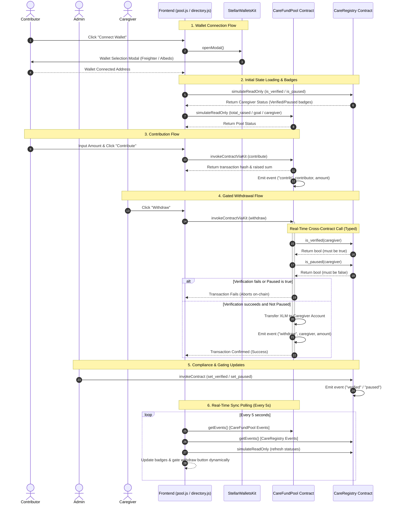

# System Architecture

This document describes the architectural flow, component relationships, security boundaries, and engineering trade-offs of the CareCredits multi-contract compliance system.

---

## 🏛️ 1. Architecture Overview

CareCredits utilizes a decoupled two-contract architecture to separate business logic (fund pooling) from compliance and administrative controls (caregiver directory verification and status gating).

```
                 +------------------------------------------+
                 |            User Browser (UI)             |
                 |     (index.html / pool.js / app.js)      |
                 +------------------------------------------+
                   /                                      \
                  / (1. load state)                        \ (2. submit tx)
                 v                                          v
      +--------------------+                      +--------------------+
      |    Horizon RPC     |                      |    Soroban RPC     |
      |   (Balance/Ledger) |                      |    (Simulation)    |
      +--------------------+                      +--------------------+
                                                            |
                                                            | (3. invoke)
                                                            v
                                                  +--------------------+
                                                  |  CareFundPool V2   |
                                                  |     Contract       |
                                                  +--------------------+
                                                            |
                                                            | (4. cross-contract call)
                                                            v
                                                  +--------------------+
                                                  |    CareRegistry    |
                                                  |     Contract       |
                                                  +--------------------+
```

### Components:
1.  **Frontend Client:** A vanilla HTML5/JS single-page web interface utilizing the `StellarSdk` and `StellarWalletsKit` to handle wallet connections, ledger subscriptions, and state updates.
2.  **`CareRegistry` Smart Contract:** Stores admin-controlled configuration and mappings for caregiver validation status (`is_verified`) and temporary block controls (`is_paused`).
3.  **`CareFundPool` Smart Contract (V2):** Orchestrates individual pool raising, goal validation, and token releases. It dynamically queries the registry contract before executing any withdrawal.

---

## 🔄 2. Complete System Data Flow

The following sequence diagram details the full lifecycle of a user session, from connecting a wallet, loading contract balances, contributing funds, to executing a compliance-gated withdrawal:



---

## 🔒 3. Compile-Time Type Safety & Trade-offs

During the V2 upgrade, the cross-contract execution inside `CareFundPool` was migrated from dynamic invocation (`env.invoke_contract`) to a compile-time checked contract client.

```rust
// Generate type-safe client for CareRegistry
#[soroban_sdk::contractclient(name = "CareRegistryClient")]
pub trait CareRegistry {
    fn is_verified(env: Env, caregiver: Address) -> bool;
    fn is_paused(env: Env, caregiver: Address) -> bool;
}
```

### Architectural Decisions & Trade-offs

#### Decoupled Compliance
*   *Design:* Keeping the compliance logic inside a separate contract (`CareRegistry`) allows a single, central registry to serve multiple different fund pools.
*   *Trade-off:* Requires an extra cross-contract call during withdrawals, slightly increasing gas consumption, but provides centralized management.

#### Type-Safe Client Generation
*   *Design:* By declaring the `CareRegistry` client trait within `fund_pool/src/lib.rs`, we generate compile-time checked binders.
*   *Trade-off:* Avoids linking the entire `care_registry` dependency crate directly, which prevents bloat and symbol collisions in the final WASM outputs.

#### Real-Time Polling Sync
*   *Design:* Frontend uses a 5-second interval event sync to poll RPC entries for both contracts.
*   *Trade-off:* Functional and lightweight for Testnet, but would require an indexing layer (such as Mercury or a custom ingestion database) to scale in production without hitting public RPC limits.
