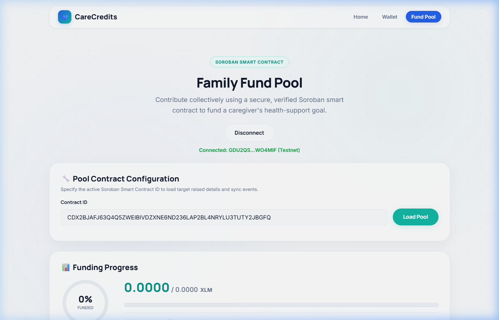
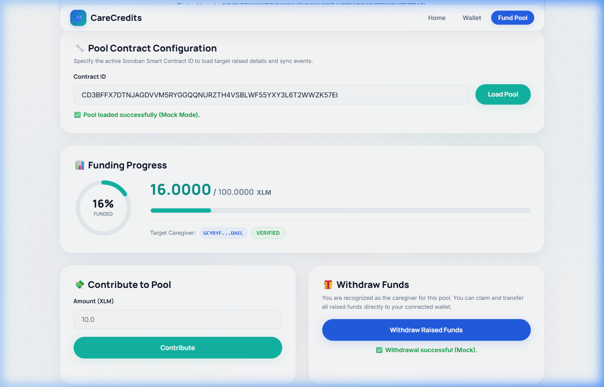

# Yellow Belt (Level 2) Submission - Family Fund Pool

Status: Approved on July 9, 2026.

## Overview

Level 2 builds on the White Belt wallet flow by adding a deployed Soroban funding pool, contract reads/writes from the frontend, transaction status tracking, error handling, and live event updates.

The current implementation is part of the same root Vite app:

- Frontend route: `/pool`
- Source file: [`src/pages/pool.js`](../src/pages/pool.js)
- Shared Stellar helpers: [`src/lib/stellar.js`](../src/lib/stellar.js)
- Error helpers: [`src/lib/utils.js`](../src/lib/utils.js)
- Pool registry data: [`src/data/pools.js`](../src/data/pools.js)

## Requirement Checklist

| Yellow Belt Requirement | Implementation |
|---|---|
| 3 error types handled | `src/lib/utils.js` classifies `WALLET_NOT_FOUND`, `USER_REJECTED`, and `INSUFFICIENT_BALANCE`. |
| Contract deployed on Testnet | CareFundPool contract and initialization transaction are listed below. |
| Contract called from frontend | `src/pages/pool.js` simulates, prepares, signs, submits, and confirms Soroban calls. |
| Read contract state | `/pool` reads `total_raised`, `goal`, and `caregiver`. |
| Write contract state | `/pool` calls `contribute(contributor, amount)` and `withdraw(caregiver)`. |
| Event listening and sync | `/pool` polls Soroban RPC events and updates the activity feed. |
| Transaction status visible | UI shows loading, simulating, waiting for signature, submitting, confirming, success, and failure states. |
| Meaningful commits | Repository history contains the staged Level 2 implementation work. |

## Testnet Contract Evidence

- CareFundPool Contract ID: [`CDYFFYP2EZE6BHSJDQJSMK6CIYBHUYHOG7GLS22EO457C32C4KPG77WO`](https://stellar.expert/explorer/testnet/contract/CDYFFYP2EZE6BHSJDQJSMK6CIYBHUYHOG7GLS22EO457C32C4KPG77WO)
- Native XLM SAC Token ID: [`CDLZFC3SYJYDZT7K67VZ75HPJVIEUVNIXF47ZG2FB2RMQQVU2HHGCYSC`](https://stellar.expert/explorer/testnet/contract/CDLZFC3SYJYDZT7K67VZ75HPJVIEUVNIXF47ZG2FB2RMQQVU2HHGCYSC)
- Initialization transaction: [`cb729fb3e895be941910adcebe241315b633bf07e6005dd959bc2c4765d79679`](https://stellar.expert/explorer/testnet/tx/cb729fb3e895be941910adcebe241315b633bf07e6005dd959bc2c4765d79679)

## Screenshots

| Evidence | Screenshot |
|---|---|
| Wallet connected |  |
| Funding pool loaded |  |
| Contribution success |  |
| Caregiver withdraw state |  |
| Withdrawal success |  |

## Run Locally

```bash
npm install
npm run dev
```

Open:

```text
http://localhost:5173/pool
```

For UI-only local testing:

```text
http://localhost:5173/pool?testmode=true
```
