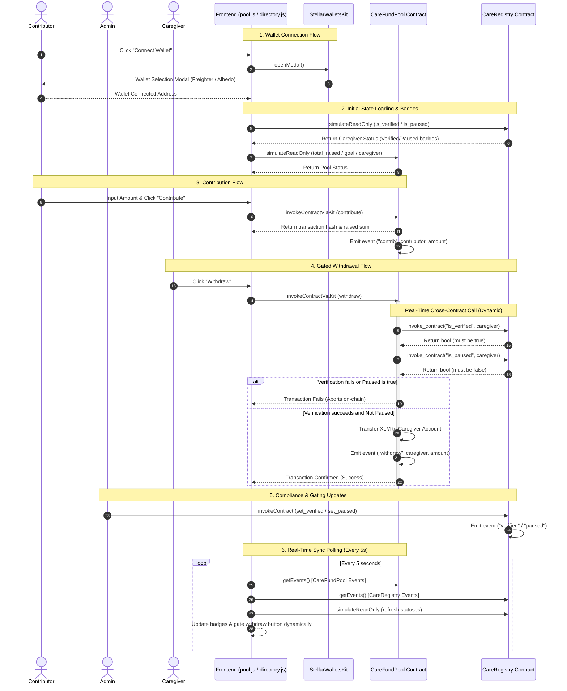

# CareCredits — Level 3 (Orange Belt) Architecture

This document describes the architectural flow, component relationships, and trade-offs of the two-contract system implemented for Level 3.

---

## 1. System Overview & Data Flow

The CareCredits system consists of a multi-wallet frontend connected to two distinct smart contracts deployed on the Stellar Testnet:

1. **`CareRegistry` Contract:** Acts as the shared registry that verifies caregiver credentials and allows admins to pause payments in case of security or compliance issues.
2. **`CareFundPool` Contract:** Handles contributions, aggregates raised XLM, and processes withdrawals. It makes a dynamic, on-chain cross-contract call to the `CareRegistry` before releasing any caregiver withdrawal.

### Sequence & Data Flow Diagram



---

## 2. Typed Cross-Contract Call Migration

Inside `CareFundPool::withdraw`, the inter-contract communication has been migrated from dynamic invocation to typed `CareRegistryClient` calls:

```rust
let registry_client = care_registry::CareRegistryClient::new(&env, &registry_address);
let is_verified = registry_client.is_verified(&caregiver);
let is_paused = registry_client.is_paused(&caregiver);
```

### Rationale:

1. **Compile-Time Type Safety (Pro):** By using the compiled `CareRegistryClient` directly, the compiler enforces method names and argument/return types. Typographical errors or method signature mismatches are caught during build, not at runtime on-chain.
2. **Close Integration:** Linking the registry crate in `CareFundPool`'s dependencies ensures that both contracts align on interface structures, making the entire compliance gating much more secure and audit-ready.

---

## 3. Real-Time Event Synchronization

The polling loop inside `pool.js` polls the Soroban RPC every 5 seconds for new events matching **both** the pool contract and the registry contract. 
- If an admin verfies/pauses a caregiver, the `verified` or `paused` events from `CareRegistry` are captured live by the polling loop, updating the badges on the UI and disabling or enabling the "Withdraw" button in real-time, even if the caregiver remains on the page.
